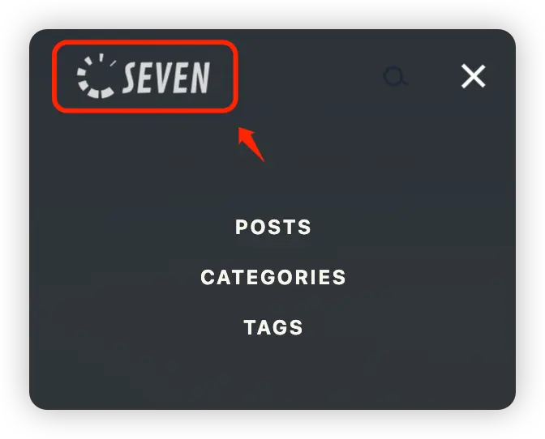
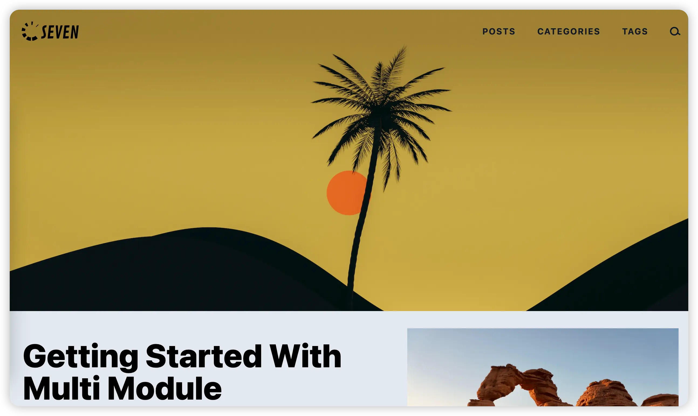
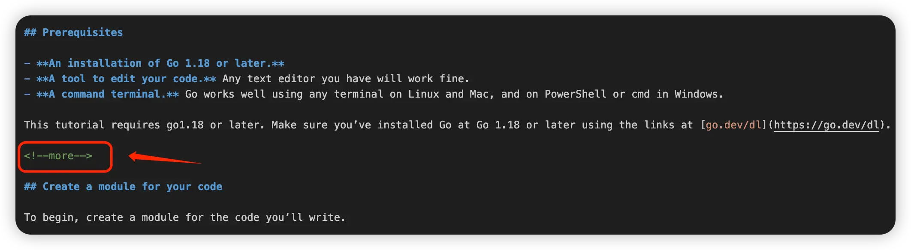
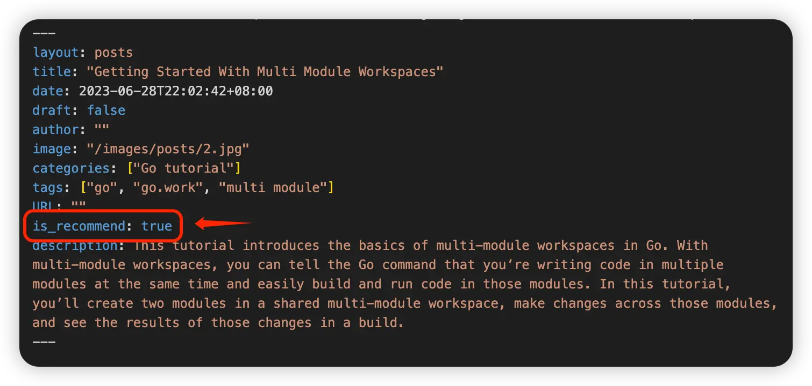
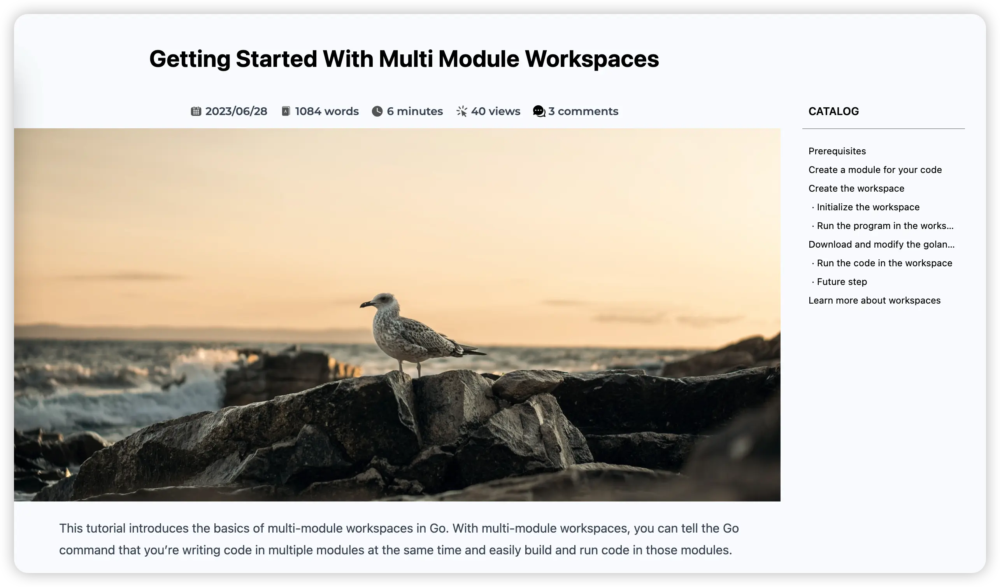

对 **Seven** 主题用到的部分配置参数进行说明，希望能帮助到大家配置 `Seven主题`。

**搜索**及**评论**相关参数会单独出篇文章进行说明。

## Logo

配置参数：

```toml
[Params.logo]
  img = "/images/logo.svg"
  img_dark = "/images/logo-footer.svg"
  img_footer = "/images/logo-footer.svg"
  img_height = ""
  footer_height = ""
  text = "Seven-Demo"
  textColor = "#50d71e"
```

主题的 Logo 可以配置 `图片版` 和 `文字版`，推荐配置`图片版`及使用 `svg格式` 的图片。

### 图片版 Logo

图片版 Logo 需要配置 3 种，分别用在正常模式、深色模式页面及页面的 Footer 区域。深色模式 logo 也可以用在 Footer 区域。所以为了更好的用户体验，至少需要准备正常、深色模式下的 logo 图。

<!--more-->

1. `img` 为正常模式下 logo 图片的地址
2. `img_dark` 为深色模式下 logo 图片的地址
3. `img_footer` 为页面 footer 区域里 logo 图片的地址

**logo 图片需要存放到 `static` 目录中**

网页的深色模式暂时还没开发，但深色 logo 在移动端设备上打开菜单时会用到，如图：



#### 自定义 logo 图片高度

通过配置`img_height`和`footer_height`参数，可以自定义导航栏和 footer 区域 logo 图片的高度，默认高度为 4rem（64px）。

### 文字版 Logo

配置在 `text` 和 `textColor` 即可。**注意：文字的颜色暂时没法分别配置，即在深色模式和 footer 中也是一样的**

## 首页内容

首页划分三部分：`hero 区域`、`最新文章区域（最多显示3篇）`和`推荐文章区域（最多显示6篇）`。

### hero 区域

hero 区域是首页最上面部分。如下图所示：



配置参数：

```toml
[Params.hero]
  img = "/images/hero/hero.jpg"
```

**hero 图片需要存在 `assets` 目录上。**

### 最新三篇文章

最新文章在首页中最多显示 3 篇。第一篇文章在左边，第二篇和第三篇在右边，且上下排版。

**注意：** 由于第一篇文章位置关系，它的`Summary`是需要手动调整的。需要在文章内容处手动添加 **\<\!--more--\>**。可查看文档[manual-summary-splitting](https://gohugo.io/content-management/summaries/#manual-summary-splitting) 进一步了解

示例：



最新内容区域可以自定义想要的文章类型，相关配置参数：

```toml
[Params.home]
  # Customize the type of content to display up-to-date,
  # and display all content with 'IsPage=true' if not.
  # eg: showContentTypes = ["posts", "blogs"]
  showContentTypes = []
```

`showContentTypes`的值是为 `.Type` 值组成的数组。具体查看[Hugo 文档 content types](https://gohugo.io/content-management/types/)及
[page 变量说明](https://gohugo.io/variables/page/)。

如果值为空数组，则显示满足 `IsPage = true` 的文章。

具体代码逻辑：

```
{{ $allPages := .Site.Pages }}
{{ with .Site.Params.home.showContentTypes }}
    {{ $allPages = where $allPages "Type" "in" . }}
{{ end }}

{{ $lastestPosts := first 3 (where $allPages "IsPage" true) }}
```

### 推荐文章

推荐文章最多显示 6 篇。且与最新文章区域类似，可以自定义想要显示的文章类型

配置参数：

```toml
[Params.home]
  ...
  # Customize the type of content to recommended,
  # and recommend contents with 'is_recommend=true' if not.
  # eg: recommendedTypes = ["posts"]
  recommendedTypes = []
```

文章需要设置为推荐才会显示在推荐文章区域。

#### 设置推荐文章

在文章的 `Front matter` 中添加 `is_recommend: true`。

如图：



## Head 部分

配置 html 文档中 `<head>` 相关的信息参数

有以下可配置参数：

```toml
languageCode = "en-us"
title = "Seven的个人网站"
description = "Seven Demo"
```

## Favicon 部分

相关配置参数：

```toml
[Params.app]
  # optional site title override for the app when added to an iOS home screen or Android launcher
  title = "Seven Demo"
  # whether to omit favicon resource links
  noFavicon = false
  # modern SVG favicon to use in place of older style .png and .ico files
  svgFavicon = "/favicon.svg"
  # Safari mask icon color
  iconColor = "#ffffff"
  # Android browser theme color
  themeColor = "#ffffff"
```

如果不想配置 Favicon，可以配置 `noFavicon = true`。

Favicon 图片有 2 种配置方式，一种是传统的 ico，另一种是使用 svg 格式，这是更加现代的方式，可参考文章[Are you using SVG favicons yet? A guide for modern browsers.](https://medium.com/swlh/are-you-using-svg-favicons-yet-a-guide-for-modern-browsers-836a6aace3df)。

如果使用 svg 格式图片设置 favicon，只需要配置 `svgFavicon` 即可，如果使用传统方式，不要配置该参数。

如果使用传统的 favicon，相关图需要存放到 `static` 目录上，且不能放在子目录中。

### 制作 Favicon 网站

这里推荐使用 [RealFaviconGenerator 网站](https://realfavicongenerator.net/)来制作 favicon。

## 显示文章信息

这里文章信息是指文章的作者、发表日期、修改日期、字数、阅读时间、hero 图片、及目录配置

默认情况下，不显示作者信息。显示发表日期、修改日期、文章字数、阅读时间、hero 图片及目录。

如图：



配置参数：

```toml
[Params.articleMeta]
  enableAuthor = false
  disableDate = false
  disableModifiedDate = false
  disableCountWords = false
  disableReadTime = false
  disableHero = false
  disableToc = false
```

### 文章 hero 图

需要在文章的 `Front matter` 中添加 `image` 配置。比如 `image: "/images/posts/2.jpg"`

**文章的 hero 图片需要存放在 `assets` 目录里**

### 文章目录

这里只有配置目录层级的配置：

```toml
[markup]
  ...

  [markup.tableOfContents]
    endLevel = 3
    startLevel = 2
```

查看文档[table-of-contents](https://gohugo.io/getting-started/configuration-markup/#table-of-contents)

### 文章的阅读量和评论数

这两个信息需要配置 [Waline](https://waline.js.org) 才能显示。在评论系统篇进一步说明。

## 独立渲染 markdown 图片配置说明（重要）

配置：

```toml
[markup]
  [markup.goldmark]
    [markup.goldmark.parser]
      wrapStandAloneImageWithinParagraph = false
      [markup.goldmark.parser.attribute]
        block = false
```

[文档说明 Context passed to render-heading](https://gohugo.io/templates/render-hooks/#context-passed-to-render-heading)

[Github 相关说明（详细）](https://github.com/gohugoio/hugo/releases/tag/v0.108.0)
