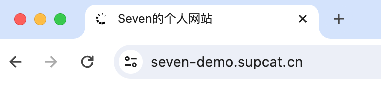
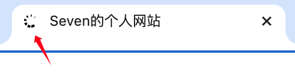
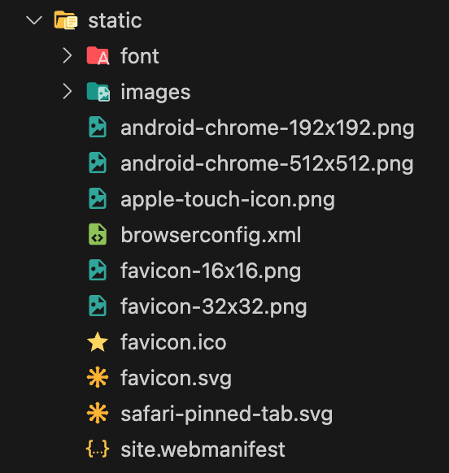
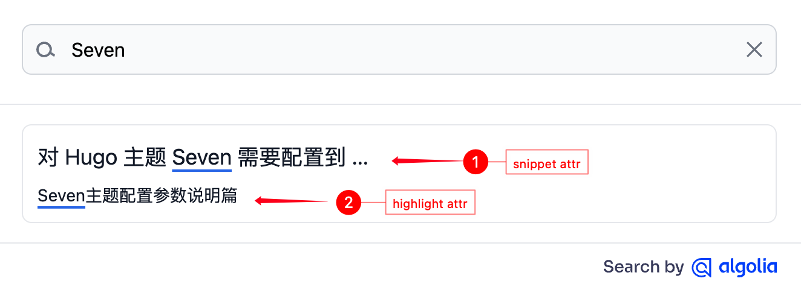
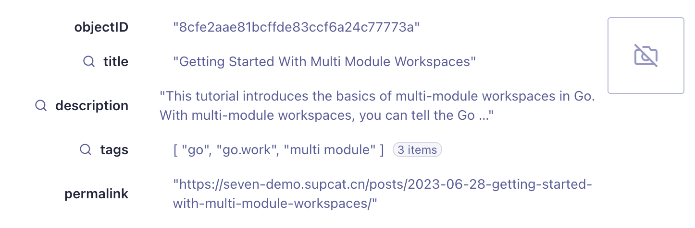

本篇文档是对 `hugo.toml` 中主要参数的说明。

## 1. 网站 Head 部分所需参数配置

网站**Head**部分是指网站的 `<head>` 标签中，包括 `<title>`、`<meta>` 需要配置的信息。

### 1.1 网站标题

网站标题是指打开网站时在浏览器标签页看到的名字



```toml
title = 'Seven的个人网站'
```

### 1.2 网站描述

```toml
[Params]
  description = "Seven Demo"
```

### 1.3 Favicon 配置



```toml
[Params.app]
  ...
  # 是否配置 favicon
  noFavicon = false
  # 使用的现代SVG favicon，用于替换旧式的.png和.ico文件
  svgFavicon = "/favicon.svg"
  iconColor = "#ffffff"
  themeColor = "#ffffff"
```

**favicon 相关文件需要放在 `static` 目录下**



favicon 相关文件可以到[RealFaviconGenerator](https://realfavicongenerator.net/) 网站直接生成

## 2. Menu 配置

### 2.1 普通菜单

只需要配置`name`和`url`，`weight`表示排序权重，`weight`越小越靠前，pre参数暂时不支持

```toml
[menu]
  ...
  [[menu.main]]
    name = "Posts"
    pre = ""
    url = "/posts/"
    weight = 30
```

### 2.2 如何配置子菜单

子菜单需要配置参数 `parent`, 表示父菜单的名称。如 ② 所示

如果导航栏中有多个子菜单，且子菜单中的名字跟其他子菜单的名字重复，需要配置 `identifier` 参数来区分，如 ① 所示

```toml
[menu]
  ...
  [[menu.main]]
    name = "Releases"
    pre = "releases"
    weight = 50
  [[menu.main]]
    identifier = "v1.0.0"   # ①
    name = 'v1.0.0'
    url = ''
    parent = 'Releases'   # ②
    weight = 1
  [[menu.main]]
    name = 'v0.1.13'
    url = ''
    parent = 'Releases'
    weight = 2
```

### 2.3 是否添加分类菜单

主题支持一键配置分类菜单按钮添加到导航栏中

```toml
[Params]
  ...
  # 是否忽略分类菜单
  omitCategoryOnMenu = false
  categoryName = "Category"
```

## 3. 如何配置 Logo

网站的Logo支持直接是**文字形式**及**图片形式**

主题更加推荐使用图片形式的 Logo

### 3.1 文字形式

```toml
[Params.logo]
  ...
  text = "Seven"
```

### 3.2 图片形式

logo 的图片需要存放在`static`目录下，建议使用 svg 格式和 png 格式的图片。

同时为了在 dark 模式下更好的显示效果，建议单独配置一个 dark 版本的

logo 图片的高度和宽度支持自定义，默认高度为 56px，宽度为 130px，且高度不能超过 56px

```toml
[Params.logo]
  img = "/images/logo.svg"
  img_dark = "/images/logo-footer.svg"

  # max height not greater than 56 (px). default: 56 (px)
  customLogoHeight = '56'
  customLogoWidth = '120'
```

## 4. 如何使用搜索功能

目前只支持 `Algolia` 搜索。如果不想启用搜索功能，可以关闭，配置参数为：

```toml
[Params]
  ...
  enableSearch = false
```

### 4.1 配置 Algolia 所需参数：

```toml
[Params.algolia]
  ...
  app_id = "your algolia app id"
  api_key = "your algolia api key"
  index = "your algolia index name"
  snippet_attr = "description"
  highlight_attr = "title"
```

`snippet_attr` 和 `highlight_attr` 配置 Algolia 搜索结果中显示的内容属性。具体可以参考[snippet](https://www.algolia.com/doc/api-reference/widgets/snippet/js/#about)和[highlight](https://www.algolia.com/doc/api-reference/widgets/highlight/js/#examples)。



### 4.2 如何配置上传到Algolia的内容

```toml
[Params.algolia]
  type = ["posts", "doc"]
  vars = ["title", "description", "permalink"]
  params = ["tags"]
  ...
```

1. `type`参数: 表示你想站点的什么内容允许上传到 Algolia。在站点的 content 目录下，你创建的目录名就是 type，比如，你创建的目录名为 post，那么type就是 post。具体值可以参考[Hugo content types](https://gohugo.io/content-management/types/)
2. `vars`参数：是 Hugo 中文章的变量，表明你文章的哪部分允许上传到 Algolia。具体值可参考[Hugo page variables](https://gohugo.io/variables/page/)
3. `params`参数：是 Hugo 的 Front matter 变量，作用类似于`vars`参数。具体值可参考[Hugo front matter](https://gohugo.io/content-management/front-matter/#front-matter-variables)

在 Algolia 中显示这样：



### 4.3 如何生成 ndjson 格式文件并上传到 Algolia

主题支持直接生成 `ndjson` 格式的文件。
因主题推荐使用`Algolia CLI`工具上传文件到 Algolia。但`Algolia CLI`需要使用到 `ndjson` 格式文件，而不是 JSON 格式文件。

在站点根目录下执行以下命令：

```bash
hugo
```

然后在`public`目录下找到`algolia.ndjson`文件，将其上传到 Algolia。

```bash
algolia objects import 'your_index_name' -F ./public/algolia.ndjson -p 'your_prifile_name'
```

具体可以参考[Algolia CLI 官方文档](https://www.algolia.com/doc/tools/cli/get-started/overview/)。

关于 Hugo 如何生成 `ndjson` 文件的说明，可以参考文章[在Hugo中如何直接输出ndjson格式文件并上传到Algolia](https://supcat.cn/posts/2023/12/24/output-ndjson-file-in-hugo-and-upload-to-algolia/)。

## 5. 如何使用评论功能

目前仅支持 Disqus 评论和 Waline 评论。

如果不想要评论功能，可以在主题的配置文件中关闭评论功能。

```toml
enableComments = false
```

### 5.1 配置 Disqus 评论

```toml
disqusShortname = "your-disqus-shortname"
```

具体可以参考[Hugo Disqus 文档](https://gohugo.io/content-management/comments/#disqus)。

### 5.2 配置 Waline 评论

```toml
[Params.waline]
  ...
  serverURL = "your-waline-server-url"
  lang = "en"
  reaction = true
  search = true
  comment = true
  ...
```

使用 Waline 需要部署才可以使用，具体如何部署请参考[Waline 文档](https://waline.js.org/guide/get-started/)。

### 5.3 使用 Waline 的文章浏览量统计功能

Waline 提供了页面浏览量统计功能。

```toml
[Params.waline]
  ...
  serverURL = "your-waline-server-url"
  ...
  pageview = true
```

如果不想要使用 Waline 评论功能，但想使用 Waline 的浏览量统计功能，可以将 `alonePageview` 设置为 `true`：

```toml
[Params.waline]
  alonePageview = true
  serverURL = "your-waline-server-url"
  ...
  pageview = true
```

具体可以参考 [Waline pageview 文档](https://waline.js.org/en/guide/features/pageview.html#use-alone)。

## 6. 如何配置首页文章的内容类型

默认情况下，首页会显示`IsPage=true`且最近的4篇文章。如果需要自定义首页文章的内容，可以配置 `showContentTypes` 参数。

## 7. 如何配置文章元信息

目前仅支持显示作者、发表日期、更新日期、文章字数、阅读时间、文章的 Hero 图和文章的目录。

```toml
[Params.articleMeta]
  enableAuthor = false
  disableDate = false
  disableModifiedDate = false
  disableCountWords = false
  disableReadTime = false
  disableHero = false
  disableToc = false
```

## 8. 支持复制文章的代码块

```toml
[Params]
  ...
  showCodeCopyButton = true
  ...
```

## 9. 如何配置社交关系

目前仅支持邮箱、Github、Facebook、X（原Twitter）和微信。

```toml
[Params.society]
  ...
  [Params.society.email]
    enable = true
    url = "your-email-url"
  [Params.society.github]
    enable = true
    url = "your-github-url"
  [Params.society.facebook]
    enable = true
    url = "your-facebook-url"
  [Params.society.x]  # old twitter
    enable = true
    url = "your-x-url"
  [Params.society.wechat]
    enable = true
    OrcodeUrl = ["微信二维码图片地址1", "微信二维码图片地址2"]
```

社交关系支持二维码的形式，比如个人微信二维码和公众号二维码。

### 9.1 自定义添加额外的社交关系

主题支持的社交关系是有限的，但主题支持自定义添加社交关系。

```toml
[Params.society]
  customSocial = "your_custom_social.html"
```

自定义的社交关系需要编写代码，并放置在`layouts/partials/`目录中。
可以参考Demo中代码，文件目录为 `layouts/partials/extra_social.html`。

## 10. 自定义主题样式

如果主题一些样式不满足你的需求，可以通过自定义样式来满足。

```toml
[Params.head]
  customCSS = "css/your_custom.css"
```

自定义的样式文件需要放在项目的`assets`目录中，不能放在`static`目录上。可以参考Demo的`assets/css/custom.css`。
