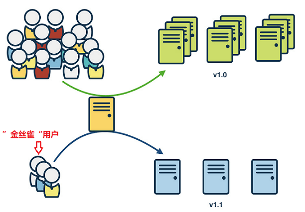
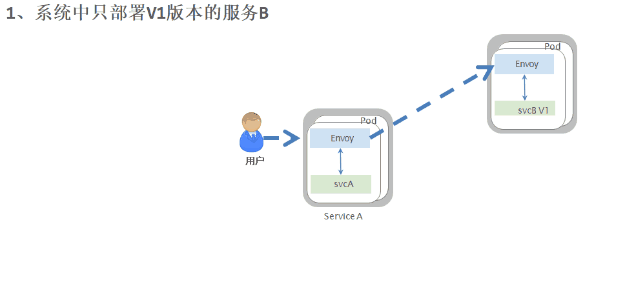
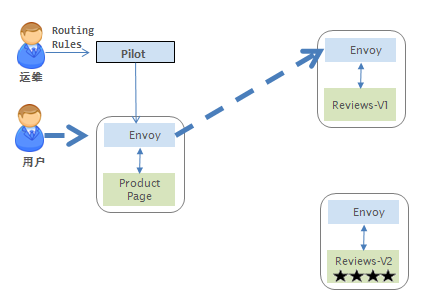
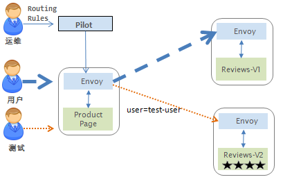
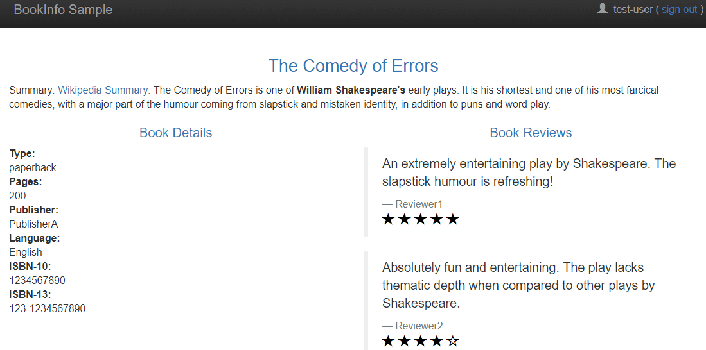
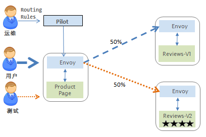
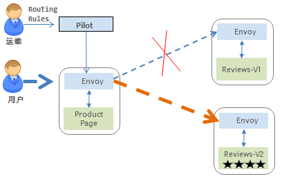
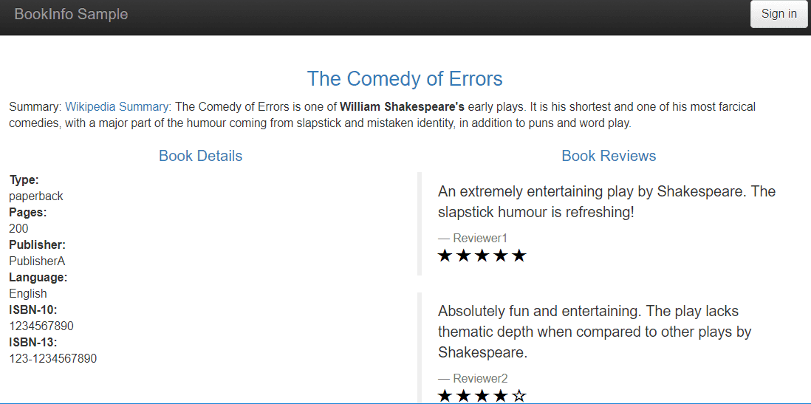

## 灰度发布（又名金丝雀发布）介绍

当应用上线以后，运维面临的一大挑战是如何能够在不影响已上线业务的情况下进行升级。做过产品的同学都清楚，不管在发布前做过多么完备的自动化和人工测试，在发布后都会出现或多或少的故障。根据墨菲定律，可能会出错的版本发布一定会出错。

"ANYTHING THAN CAN GO WRONG WILL GO WRONG" --MURPHY'S LAW

因此我们不能寄希望于在线下测试时发现所有潜在故障。在无法百分百避免版本升级故障的情况下，需要通过一种方式进行可控的版本发布，把故障影响控制在可以接受的范围内，并可以快速回退。

可以通过[灰度发布（又名金丝雀发布）](https://martinfowler.com/bliki/CanaryRelease.html)来实现业务从老版本到新版本的平滑过渡，并避免升级过程中出现的问题对用户造成的影响。

“金丝雀发布”的来源于矿工们用金丝雀对矿井进行空气测试的做法。以前矿工挖煤的时候，矿工下矿井前会先把金丝雀放进去，或者挖煤的时候一直带着金丝雀。金丝雀对甲烷和一氧化碳浓度比较敏感，会先报警。所以大家都用“金丝雀”来搞最先的测试。

下图中，左下方的少部分用户就被当作“金丝雀”来用于测试新上线的 1.1 版本。如果新版本出现问题，“金丝雀”们会报警，但不会影响其他用户业务的正常运行。



灰度发布（金丝雀发布）的流程如下：

- 准备和生产环境隔离的“金丝雀”服务器。
- 将新版本的服务部署到“金丝雀”服务器上。
- 对“金丝雀”服务器上的服务进行自动化和人工测试。
- 测试通过后，将“金丝雀”服务器连接到生产环境，将少量生产流量导入到“金丝雀”服务器中。
- 如果在线测试出现问题，则通过把生产流量从“金丝雀”服务器中重新路由到老版本的服务的方式进行回退，修复问题后重新进行发布。
- 如果在线测试顺利，则逐渐把生产流量按一定策略逐渐导入到新版本服务器中。
- 待新版本服务稳定运行后，删除老版本服务。

## Istio 实现灰度发布(金丝雀发布)的原理

从上面的流程可以看到，如果要实现一套灰度发布的流程，需要应用程序和运维流程对该发布过程进行支持，工作量和难度的挑战是非常大的。虽然面对的问题类似，但每个企业或组织一般采用不同的私有化实现方案来进行灰度发布,为解决该问题导致研发和运维花费了大量的成本。

Istio 通过高度的抽象和良好的设计采用一致的方式解决了该问题，采用 sidecar 对应用流量进行了转发，通过 Pilot 下发路由规则，可以在不修改应用程序的前提下实现应用的灰度发布。

备注：采用 kubernetes 的[滚动升级(rolling update)](https://kubernetes.io/docs/tasks/run-application/rolling-update-replication-controller/)功能也可以实现不中断业务的应用升级,但滚动升级是通过逐渐使用新版本的服务来替换老版本服务的方式对应用进行升级，在滚动升级不能对应用的流量分发进行控制，因此无法采用受控地把生产流量逐渐导流到新版本服务中，也就无法控制服务升级对用户造成的影响。

采用 Istio 后，可以通过定制路由规则将特定的流量（如指定特征的用户）导入新版本服务中，在生产环境下进行测试，同时通过渐进受控地导入生产流量，可以最小化升级中出现的故障对用户的影响。并且在同时存在新老版本服务时，还可根据应用压力对不同版本的服务进行独立的缩扩容，非常灵活。采用 Istio 进行灰度发布的流程如下图所示：



## 操作步骤

下面采用 Istion 自带的 BookinfoInfo 示例程序来试验灰度发布的流程。

### 测试环境安装

首先参考[手把手教你从零搭建 Istio 及 Bookinfo 示例程序](http://zhaohuabing.com/2017/11/04/istio-install_and_example/)安装 Kubernetes 及 Istio 控制面。

因为本试验并不需要安装全部 3 个版本的 reviews 服务，因此如果已经安装了该应用，先采用下面的命令卸载。

```
istio-0.2.10/samples/bookinfo/kube/cleanup.sh
```

### 部署 V1 版本的服务

首先只部署 V1 版本的 Bookinfo 应用程序。由于示例中的 yaml 文件中包含了 3 个版本的 reviews 服务，我们先将 V2 和 V3 版本的 Deployment 从 yaml 文件 istio-0.2.10/samples/bookinfo/kube/bookinfo.yaml 中删除。

从 Bookinfo.yaml 中删除这部分内容:

```
apiVersion: extensions/v1beta1
kind: Deployment
metadata:
  name: reviews-v2
spec:
  replicas: 1
  template:
    metadata:
      labels:
        app: reviews
        version: v2
    spec:
      containers:
      - name: reviews
        image: istio/examples-bookinfo-reviews-v2:0.2.3
        imagePullPolicy: IfNotPresent
        ports:
        - containerPort: 9080
---
apiVersion: extensions/v1beta1
kind: Deployment
metadata:
  name: reviews-v3
spec:
  replicas: 1
  template:
    metadata:
      labels:
        app: reviews
        version: v3
    spec:
      containers:
      - name: reviews
        image: istio/examples-bookinfo-reviews-v3:0.2.3
        imagePullPolicy: IfNotPresent
        ports:
        - containerPort: 9080
---
```

部署 V1 版本的 Bookinfo 程序。

```
kubectl apply -f <(istioctl kube-inject -f istio-0.2.10/samples/bookinfo/kube/bookinfo.yaml)
```

通过 kubectl 命令行确认 pod 部署，可以看到只有 V1 版本的服务。

```
kubectl get pods

NAME                              READY     STATUS    RESTARTS   AGE
details-v1-3688945616-nhkqk       2/2       Running   0          2m
productpage-v1-2055622944-m3fql   2/2       Running   0          2m
ratings-v1-233971408-0f3s9        2/2       Running   0          2m
reviews-v1-1360980140-0zs9z       2/2       Running   0          2m
```

在浏览器中打开应用程序页面，地址为 istio-ingress 的 External IP。由于 V1 版本的 reviews 服务并不会调用 rating 服务，因此可以看到 Product 页面显示的是不带星级的评价信息。

`http://10.12.25.116/productpage`


此时系统中微服务的部署情况如下图所示（下面的示意图均忽略和本例关系不大的 details 和 ratings 服务）：

### 部署 V2 版本的 reviews 服务

在部署 V2 版本的 reviews 服务前，需要先创建一条缺省路由规则 route-rule-default-reviews.yaml，将所有生产流量都导向 V1 版本，避免对线上用户的影响。

```
apiVersion: config.istio.io/v1alpha2
kind: RouteRule
metadata:
  name: reviews-default
spec:
  destination:
    name: reviews
  precedence: 1
  route:
  - labels:
      version: v1
```

启用该路由规则。

```
istioctl create -f route-rule-default-reviews.yaml -n default
```

创建一个 V2 版本的部署文件 bookinfo-reviews-v2.yaml，内容如下

```
apiVersion: extensions/v1beta1
kind: Deployment
metadata:
  name: reviews-v2
spec:
  replicas: 1
  template:
    metadata:
      labels:
        app: reviews
        version: v2
    spec:
      containers:
      - name: reviews
        image: istio/examples-bookinfo-reviews-v2:0.2.3
        imagePullPolicy: IfNotPresent
        ports:
        - containerPort: 9080
```

部署 V2 版本的 reviews 服务。

```
kubectl apply -f <(istioctl kube-inject -f  bookinfo-reviews-v2.yaml)
```

此时系统中部署了 V1 和 V2 两个版本的 reviews 服务，但所有的业务流量都被规则 reviews-default 导向了 V1，如下图所示：



### 将测试流量导入到 V2 版本的 reviews 服务

在进行模拟测试时，由于测试环境和生产环境的网络，服务器，操作系统等环境存在差异，很难完全模拟生产环境进行测试。为了减少环境因素的对测试结果的影响，我们希望能在生产环境中进行上线前的测试，但如果没有很好的隔离措施，可能会导致测试影响已上线的业务，对企业造成损失。

通过采用 Istio 的路由规则，可以在类生产环境中进行测试，又完全隔离了线上用户的生产流量和测试流量，最小化模拟测试对已上线业务的影响。如下图所示：



创建一条规则，将用户名为 test-user 的流量导入到 V2

```
apiVersion: config.istio.io/v1alpha2
kind: RouteRule
metadata:
  name: reviews-test-user
spec:
  destination:
    name: reviews
  precedence: 2
  match:
    request:
      headers:
        cookie:
          regex: "^(.*?;)?(user=test-user)(;.*)?$"
  route:
  - labels:
      version: v2
```

注意：precedence 属性用于设置规则的优先级，在同时存在多条规则的情况下，优先级高的规则将先执行。这条规则的 precedence 设置为 2，以确保其在缺省规则之前运行，将 test-user 用户的请求导流到 V2 版本 reviews 服务中。

启用该规则。

```
istioctl create -f route-rule-test-reviews-v2.yaml -n default
```

以 test-user 用户登录，可以看到 V2 版本带星级的评价页面。



注销 test-user，只能看到 V1 版本不带星级的评价页面。如下图所示：


### 将部分生产流量导入到 V2 版本的 reviews 服务

在线上模拟测试完成后，如果系统测试情况良好，可以通过规则将一部分用户流量导入到 V2 版本的服务中，进行小规模的“金丝雀”测试。

修改规则 route-rule-default-reviews.yaml，将 50%的流量导入 V2 版本。

> 备注：本例只是描述原理，因此为简单起见，将 50%流量导入 V2 版本，在实际操作中，更可能是先导入较少流量，然后根据监控的新版本运行情况将流量逐渐导入，如采用 5%，10%，20%，50% ...的比例逐渐导入。

```
apiVersion: config.istio.io/v1alpha2
kind: RouteRule
metadata:
  name: reviews-default
spec:
  destination:
    name: reviews
  precedence: 1
  route:
  - labels:
      version: v1
    weight: 50
  - labels:
      version: v2
    weight: 50
```

```
istioctl replace -f route-rule-default-reviews.yaml -n default
```

此时系统部署如下图所示：



### 将所有生产流量导入到到 V2 版本的 reviews 服务

如果新版本的服务运行正常，则可以将所有流量导入到 V2 版本。

```
apiVersion: config.istio.io/v1alpha2
kind: RouteRule
metadata:
  name: reviews-default
spec:
  destination:
    name: reviews
  precedence: 1
  route:
  - labels:
      version: v2
    weight: 100
```

```
istioctl replace -f route-rule-default-reviews.yaml -n default
```

系统部署如下图所示：



此时不管以任何用户登录，都只能看到 V2 版本带星级的评价页面，如下图所示：



> 备注：如果灰度发布的过程中新版本的服务出现问题，则可以通过修改路由规则，将流量重新导入到 V1 版本的服务中，将 V2 版本故障修复后再进行测试。

### 删除 V1 版本的 reviews 服务

待 V2 版本上线稳定运行后，删除 V1 版本的 reviews 服务和测试规则。

```
kubectl delete pod reviews-v1-1360980140-0zs9z

istioctl delete -f route-rule-test-reviews-v2.yaml -n default
```

## 参考

- [Istio 官方文档](https://istio.io/docs/)
