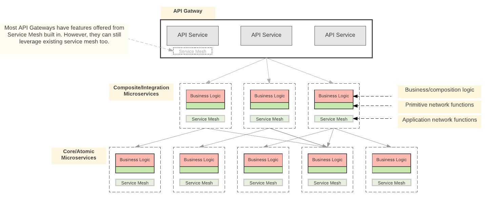

## Service Mesh vs API Gateway

在[前一篇关于 Service Mesh 的文章](https://medium.com/microservices-in-practice/service-mesh-for-microservices-2953109a3c9a)中,我提到了几个关于 Service Mesh 和 API Gateway 之间关系的问题，在本篇文章中，我打算就 Service Mesh 和 API Gateway 的用途进行进一步讨论。

为了区分 API Gateway 和 Service Mesh，让我们先分别看看两者各自的关键特征。

## API Gateway: 将服务作为被管理的 API 向外部暴露

使用 API Gateway 的主要目的是将微服务作为被管理的 API 暴露（给外部系统）。因此，我们在 API Gateway 层开发的 API 或者边界服务对外提供了业务功能。

API/边界服务调用下游的组合或者原子微服务，通过组合/混装多个下游微服务的方式来提供业务逻辑。

在 API/Edge 服务调用下游服务时，需要采用一种可靠的通信方式，应用了断路器，超时，负载均衡/故障转移等可靠性模式。因此大部分的 API Gateway 解决方案都内置了这些特性。

API Gateway 也内置了以下特性的支持，包括：服务发现，分析（可见性：性能指标，监控，分布式日志，分布式调用追踪）和安全。

API Gateway 和 API 管理生态系统的其他组件的关系紧密，比如： API 市场/商店， API 发布门户。

## Service Mesh：微服务的网络通信基础设施

现在我们来看看 Service Mesh 有哪些不同。

Service Mesh 是一个网络通信基础设施， 可以用于将应用层的网络通信功能从你的服务代码中剥离出来。

采用 Service Mesh， 你不用在服务代码中实现用于可靠通信的模式如断路，超时等，类似地，Service Mesh 也提供了服务发现，服务可见性等其他功能。

## API Gateway 和 Service Mesh 实践

API Gateway 和 Service Mesh 之间的主要不同点：API Gateway 是暴露 API/边界服务的关键组件，而 Service Mesh 则仅仅是一个服务间通信的基础设施，并不了解应用中的业务逻辑。

下图说明了 API Gateway 和 Service Mesh 的关系。如同前面所说，这两者之间也有一些重叠的部分（例如断路器等），但重要的是需要理解这两者是用于完全不同的用途。

如上图所示，Service Mesh 作为 Sidecar（边车）和服务一起部署，它是独立于服务的业务逻辑的。

另一方面，API Gateway 提供了所有的 API 服务（这些 API 服务有明确定义的业务功能），它是应用业务逻辑的一部分。API Gateway 可以具有内建的服务间通信能力，但它也可以使用 Service Mesh 来调用下游服务（API Gateway->Service Mesh->Microservices）。

在 API 管理层次，你可以使用 API Gateway 内建的服务间通信能力；也可以通过 Service Mesh 来调用下游服务，以将应用网络通信功能从应用程序转移到 Service Mesh 中。

## 译者按

API Gateway 和 Service Mesh 的关系是我最近一直在思考的问题，也和同事及社区的朋友之间进行了一些讨论。这篇短文很清晰地总结了两者之间的相似之处以及这两者在微服务架构中的不同用途。

文章中提到“可以使用 API Gateway 内建的服务间通信能力；也可以通过 Service Mesh 来调用下游服务”。在和同事讨论时，大家提到一个比较重要的考虑因素是在 API Gateway 处引入一个 Sidecar 可能带来的额外延迟。

API Gateway 作为微服务引用的流量入口，其对效率要求较高，如果随 API Gateway 部署一个 Sidecar，可能对效率有一定影响。

我对此未进行测试，但从理论上来说，服务发现，重试，断路等逻辑无论放到 API Gateway 还是 Service Mesh 中耗时应该是差不多的，部署 Sidecar 只是增加了创建一个本地链接的消耗，如下图所示:

将 API Gateway 和 Service Mesh 的功能进行清晰划分，API Gateway 负责应用逻辑，Service Mesh 负责服务通讯，Metrics 收集等微服务基础设施，这样划分后在架构上更为清晰。对于效率问题，我们可以考虑对 API Gateway 进行水平扩展来解决。

## 原文

本译文发表已征得原作者同意，原文参见 [Service Mesh vs API Gateway](https://medium.com/microservices-in-practice/service-mesh-vs-api-gateway-a6d814b9bf56)
